# autoturret

This project aims to leverage a Raspberry Pi to process an detect motion in a frame; this motion data is then sent to an Arduino where it will control two servos to point toward the motion.

The general flow of the system is as follows:

The most important thing to note from the diagram is that the serial connection is two-way, while the i2c connection is one-way slave to master. 

# Raspberry Pi Setup Notes

## Housekeeping
Expand filesystem

    sudo raspi-config

Check storage available

    df -h 

Install dependencies 

    sudo apt-get update && sudo apt-get upgrade 

## For video handling

    sudo apt-get install libjpeg-dev libtiff5-dev libjasper-dev libpng12-dev
    sudo apt-get install libavcodec-dev libavformat-dev libswscale-dev libv4l-dev
    sudo apt-get install libxvidcore-dev libx264-dev

## For the drawing and opencv stuff

    sudo apt-get install libgtk2.0-dev libgtk-3-dev
    sudo apt-get install libatlas-base-dev gfortran
    sudo apt-get install python-smbus python3-smbus python-dev python3-dev
    sudo apt-get install i2c-tools

## Additional packages that'll make things faster

    sudo pip install numpy
    sudo pip install imutils

## The actual important bit

    sudo apt-get install python-opencv

## Make it easier to find the pi 

    sudo apt-get install samba
    
   This allows ping raspberrypi to respond on Windows.

## Auto run at start

    sudo nano /etc/profile

Add this snippet to the bottom:

    sudo python ~/Desktop/main.py &

